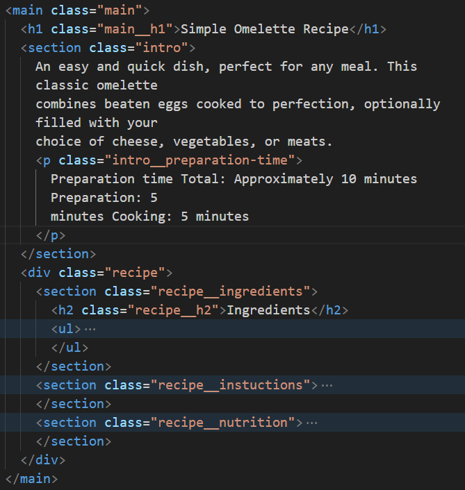

# Frontend Mentor - Recipe page solution

This is a solution to the [Recipe page challenge on Frontend Mentor](https://www.frontendmentor.io/challenges/recipe-page-KiTsR8QQKm). Frontend Mentor challenges help you improve your coding skills by building realistic projects.

## What I learned

### Make CSS style more reusable

avoid content-specific names

make name more generic

### Reduce the font-size if the width is less then a number using clamp() function

my target :
clamp(8px, n vw, 16px)
if the default font-size is 16px, I want the font size reduced when the window width is less than 'x px'

about the clamp function :
clamp(min, preffer, max)
max - 16px
preffer - unknown \*the unit should be a relative number (vw, vh, %...)
min - the minimum size you want

to get the n :
1vw = x / 100
n vw = n \* x / 100
so if the current window width = 1600px --> 1vw = 16px

we want n vw = 16px
n _ x / 100 = 16px
n = 16 _ 100 / x
so if the x = 800px, n would be 2
the clamp function would be :
clamp(8px, 2vw, 16px)

or you can think this way
if the current window size is x, what number times (x / 100) would be 16
